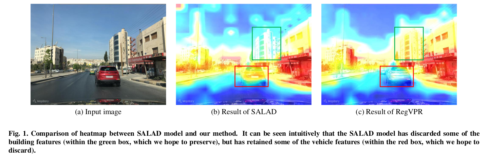
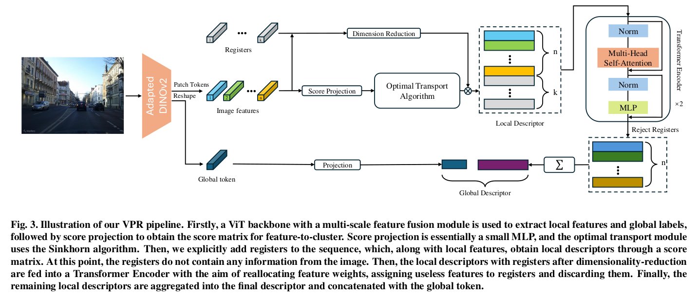
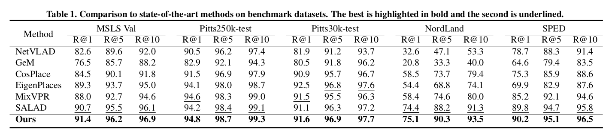
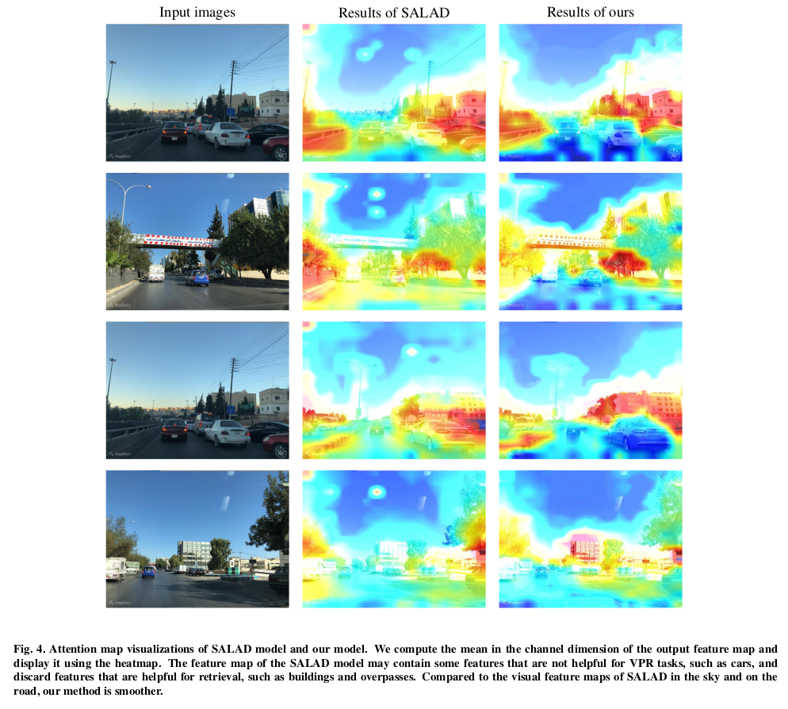

# Register assisted aggregation for Visual Place Recognition
Xuan Yu, Zhenyong Fu

## Introduction
We propose a new method, which uses Registers to assist in removing irrelevant information from image representations in VPR tasks while preserving valid information, called RegVPR. 

Our method introduces registers during the feature aggregation process and uses a Transformer Encoder containing self-attention mechanism to reassign feature weights on the original image tokens and the local descriptor sequence after register concatenation. 

Our main contribution is the redistribution of attention weights in feature maps, allowing the model to focus on robust features in the image, thereby improving the accuracy of visual place recognition.


## Method


## Result


## Qualitative result


## Our code is coming soon.

## Acknowledgements
This work was supported by the National Natural Science Foundation of China (Grant Nos.62276132 and 61876085).

## Cite
```
@article{yu2024register,
  title={Register assisted aggregation for Visual Place Recognition},
  author={Yu, Xuan and Fu, Zhenyong},
  journal={arXiv preprint arXiv:2405.11526},
  year={2024}
}
